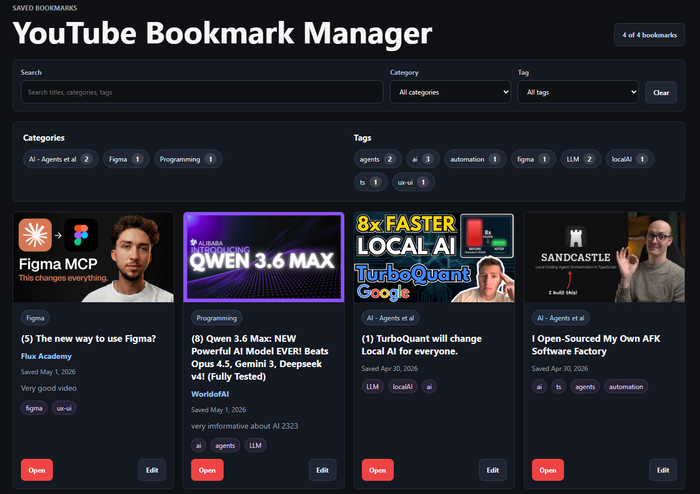

# YouTube Bookmark Manager

A simple bookmark manager extension for the Chrome Browser, for saving, organizing, and quickly revisiting your favorite YouTube videos.

## Features

- Save YouTube video links
- Organize bookmarks by category or tags
- Save a Video on a Specific timestamp with a note
- Search saved videos
- Open saved videos directly on YouTube
- Edit a bookmarked video according to your needs
- Import and export your bookmarks as JSON
- Automatic backup to Chrome sync storage with auto-restore after reinstall
- Sync bookmarks across devices through a private GitHub gist
- Clean and simple interface

## Use Case

YouTube Bookmark Manager helps you keep track of useful videos, tutorials, music, documentaries, courses, and anything else you want to watch later or reference again.

Instead of losing links in browser bookmarks, chats, or notes, you can store everything in one organized place.

## Keeping your data safe

Your bookmarks live in Chrome extension storage on your device. The extension protects them in three ways:

- **Sync backup.** Every change is mirrored to Chrome sync storage, so bookmarks survive a reinstall and follow your Google account when Chrome Sync is on.
- **Export / Import.** Download your full collection as a JSON file and restore it on any device at any time.
- **GitHub gist sync.** Optionally connect a GitHub personal access token and push/pull your bookmarks through a secret gist to move them between computers.

Deleting all bookmarks clears both local storage and the sync backup, so export first if you want a copy.

## Installation

Soon to be found on the Chrome Web Store.
Till then,
1. Clone the repo
2. Set Chrome to dev mode
3. From the Chrome extensions: "Load Unpacked" and choose the directory of the repo.
